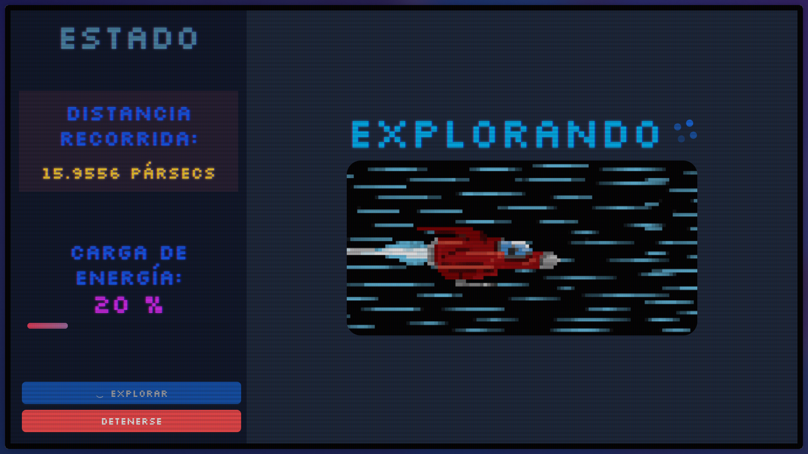

# Planet Dashboard 🚀

¡Bienvenido al panel de control de la nave! Este proyecto es un dashboard interactivo que simula la cabina de una nave espacial en una misión para explorar planetas.

La aplicación presenta diferentes estados de navegación y utiliza una estética retro de monitor CRT, completa con animaciones de parpadeo, fuentes pixeladas y efectos visuales para una experiencia inmersiva.

> [!NOTE]
> El efecto CSS CRT no es de mi autoría, ni el diseño de la nave.

## Spoiler:




## ✨ Características Principales

- **Panel de Control Interactivo**: Controla el estado de la nave a través de un panel lateral.
- **Máquina de Estados**: Simula diferentes fases de una misión espacial como `Despegando`, `Explorando`, `Sin Energía`, etc., cada una con su propia vista.
- **Estética Retro CRT**: Efectos visuales como parpadeo de pantalla (`flicker`), sombra de texto y animaciones de color para emular un monitor de rayos catódicos.
- **Fuentes Pixeladas**: Uso de las fuentes `Silkscreen` y `DotGothic16` para reforzar el estilo retro.
- **Diseño Moderno**: Construido con componentes de Ant Design y estilizado con la flexibilidad de Tailwind CSS.

## 🛠️ Tecnologías Utilizadas

- **React**: Biblioteca principal para la construcción de la interfaz de usuario. Se utiliza la API de Contexto (`StatusContext`) para el manejo del estado global de la aplicación.
- **Vite**: Empaquetador y servidor de desarrollo rápido.
- **Ant Design**: Para la estructura de `Layout` y componentes UI robustos.
- **Tailwind CSS**: Para las utilidades de estilo y el diseño responsivo.
- **ESLint + Neostandard**: Para el linting y mantener la calidad y consistencia del código.

## 🚀 Instalación y Puesta en Marcha

Sigue estos pasos para tener una copia del proyecto funcionando en tu máquina local.

### Prerrequisitos

Asegúrate de tener Node.js (versión 18 o superior) y npm instalados.

```sh
node -v
npm -v
```

### Pasos

1.  **Clona el repositorio**
    ```sh
    # Reemplaza la URL con la de tu repositorio
    git clone https://github.com/tu-usuario/02-planet-dashboard.git
    cd 02-planet-dashboard
    ```

2.  **Instala las dependencias**
    Ejecuta el siguiente comando en la raíz del proyecto:
    ```sh
    npm install
    ```

3.  **Inicia la aplicación en modo desarrollo**
    Este comando iniciará el servidor de desarrollo de Vite.
    ```sh
    npm run dev
    ```

4.  Abre http://localhost:5173 (o el puerto que indique la consola) en tu navegador para ver la aplicación.

## 📜 Scripts Disponibles

- `npm run dev`: Inicia la aplicación en modo de desarrollo.
- `npm run build`: Compila la aplicación para producción.
- `npm run lint`: Ejecuta el linter (ESLint) para revisar el código.
- `npm run preview`: Sirve la build de producción localmente para previsualizarla.