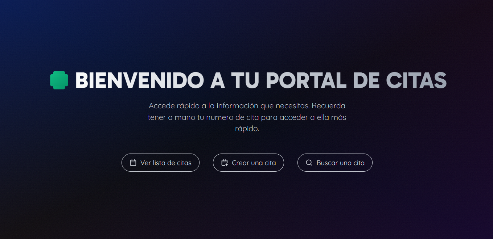
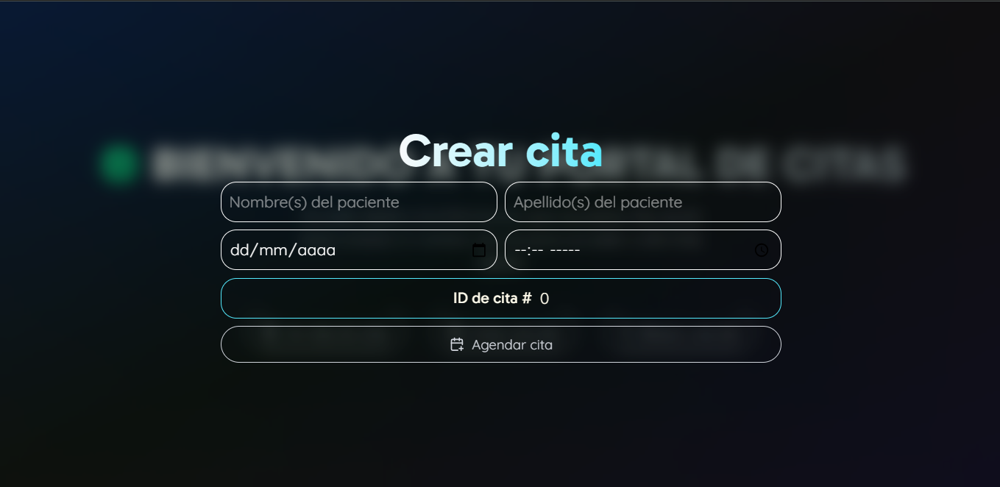
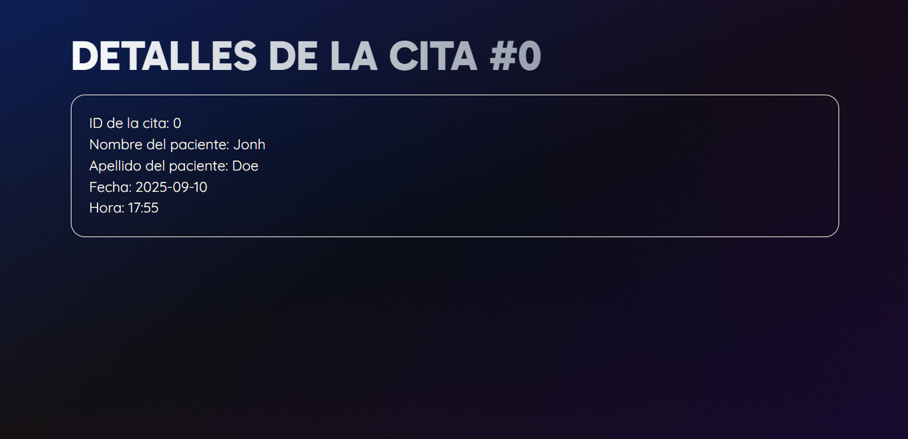

# 🩺 Portal de Citas

Workshop #7 portal citas

Este proyecto permite **crear, buscar y listar citas médicas** de manera rápida y sencilla.  

## 🔍 Spoiler
Home

Crear cita

Buscar cita

Lista de citas

Detalle de cita

## 🚀 Tecnologías
- **React + Vite** → para el front y navegación.
- **React Router DOM** → manejo de rutas dinámicas (`/cita/:id`).
- **Context API** → estado global para la lista de citas.
- **TailwindCSS** → estilos modernos y responsivos.
- **Lucide React** → íconos.

## ⚙️ Funcionamiento
- Crear citas con nombre, apellido, fecha y hora.  
- Cada cita se guarda en **localStorage** para no perderse al recargar.  
- Se asigna un **ID automático** a cada cita.  
- Al crear una cita, el usuario es redirigido al detalle.  
- También se puede ver la lista completa o buscar por ID.

